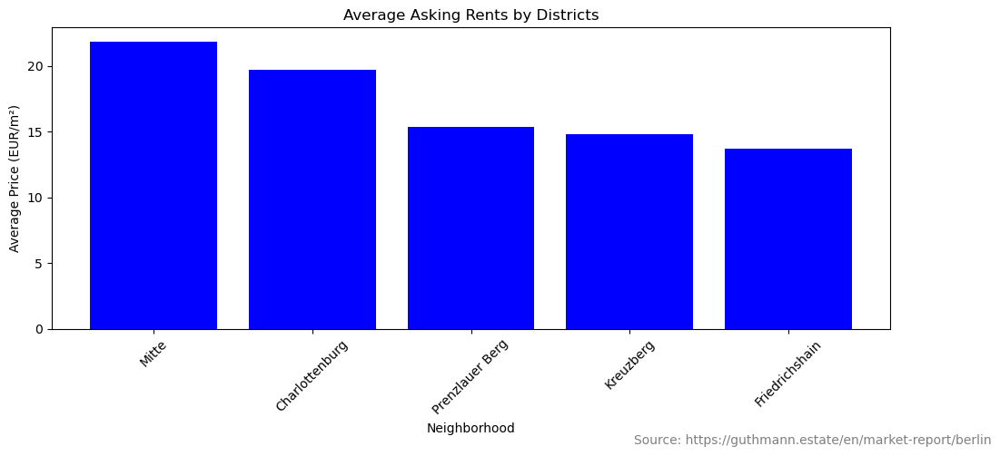
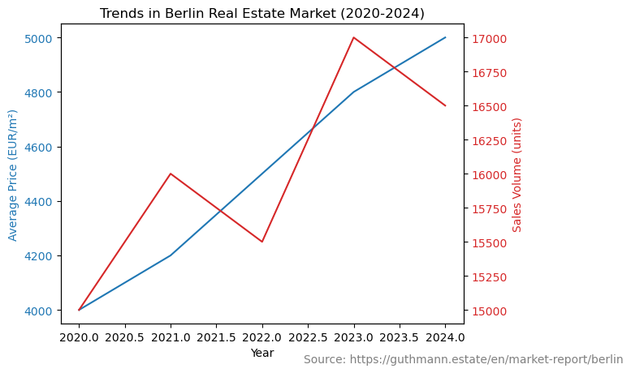

# Factors Affecting Urban Home Rental Prices: Berlin's Experience

as part of the course **Financial Data Analytics in Python**  
**Prof. Dr. Fabian Woebbeking**


Submitted by : **Morteza Motegh (222235729)**  
MLU - Martin Luther University Halle-Wittenberg

morteza.motegh@student.uni-halle.de

## 1. Introduction

Berlin’s rental market has been shaped by many factors: migration, population growth, ownership rates, monetary policy, geopolitical crises and housing policy. In the early 2000s Berlin’s rents were much lower than other major European cities because there was plenty of supply and less demand. This affordability, combined with the cultural scene and opportunities, attracted many to the city and drove up the rents (Guthmann, 2024). This article looks at the main factors that influence real estate prices in Berlin.

Key Factors:

**Location:** The location within Berlin, especially to amenities and economic hubs, has a big impact on real estate prices. Properties near city centers or nice locations (riverside etc.) have higher rents because of their location (Guthmann, 2024).

**Amenities:** The availability and quality of local facilities (shopping centers, parks, schools) is important for property valuation. Good amenities make life better and therefore increase property appeal (BNP Paribas Real Estate, 2024).

**Neighborhood:** The socio-economic status, looks and community of the neighborhood also determines property value. Areas with high income residents and well maintained environment have higher property prices (Guthmann, 2024).

**Transportation:** Access to public transport, main roads and bike paths is important for real estate values. Properties with good transport links attract more buyers and renters and therefore increase prices (DW, 2023).

**Market Demand:** Economic conditions, population growth and consumer sentiment towards the housing market shape demand for real estate. Population growth due to migration and economic opportunities leads to higher housing demand and prices (BNP Paribas Real Estate, 2024).

## 2. Impact of Location

Properties near the city or in nice areas (by rivers or parks) get higher rent. Near good schools, hospitals and cultural events adds to the value of the property as it’s convenient to access services and amenities (Guthmann, 2024).

### 2.1 Case Study


```python
import pandas as pd
import matplotlib.pyplot as plt

data = {
    "Neighborhood": ["Mitte", "Charlottenburg", "Prenzlauer Berg", "Kreuzberg", "Friedrichshain"],
    "Average Price (EUR/m²)": [21.85, 19.70, 15.35, 14.80, 13.70]
}

df = pd.DataFrame(data)

plt.figure(figsize=(10, 5))
plt.bar(df['Neighborhood'], df['Average Price (EUR/m²)'], color='blue')
plt.title('Average Asking Rents by Districts')
plt.xlabel('Neighborhood')
plt.ylabel('Average Price (EUR/m²)')
plt.xticks(rotation=45)
plt.tight_layout()

plt.figtext(0.9, 0.01, 'Source: https://guthmann.estate/en/market-report/berlin', ha='center', fontsize=10, color='gray')

plt.show()

```


    

    


**Interpretation of the Table:**

- **Mitte**: Mitte has the highest average price of 21.85 EUR/m2, and its central location and closeness to essential amenities and commercial centers make it quite desirable. 
- **Charlottenburg**: Priced at 19.70 EUR/m2, this area is known for its historical charm and upscale living.  
- **Prenzlauer Berg**: Because to its active atmosphere and services, this neighborhood attracts young adults and families, with an average price of 15.35 EUR/m2.  
- **Kreuzberg**: At 14.80 EUR/m2, Kreuzberg's cultural diversity and modern vibe attract many buyers.  
- **Friedrichshain**: With an average price of 13.70 EUR/m2, this area is popular for its nightlife and artistic culture.


## 3. Influence of Amenities

Amenities increase property value by improving lifestyle. Retail and supermarkets for daily needs, parks and recreational facilities for quality of life. High end health and fitness centers attract health conscious people, makes these areas more desirable (BNP Paribas Real Estate, 2024).

## 4. Impact of Neighborhood

Neighborhood features such as socioeconomic status, maintenance, crime rates, and community unity significantly impact property values. High-income areas with robust local economies attract wealthier buyers, leading to increased property prices. Well-maintained neighborhoods with low crime rates and a strong sense of community also see higher property values (Guthmann, 2024).

## 5. Impact of Transportation Access

Efficient public transportation systems enhance property values by providing easy access to city amenities and reducing commuting costs. Proximity to major roads and highways makes neighborhoods attractive to commuters, further driving up home values. Areas with extensive biking paths also appeal to those seeking sustainable lifestyles (DW, 2023).

## 6. Impact of Market Demand

Real estate prices are heavily influenced by factors such as consumer perspective, interest rates, economic conditions, and population expansion. There is a greater demand for housing in areas where migration or business opportunities are causing population growth. Good economic times boost purchasing power and increase demand for real estate by increasing employment and salary levels. Reduced borrowing costs due to lower interest rates stimulate real estate investment and drive up property prices (BNP Paribas Real Estate, 2024; DW, 2023).


### 6.1 Case study


```python
years = [2020,2021,2022,2023,2024]
average_prices = [4000, 4200, 4500, 4800, 5000]  
sales_volume = [15000, 16000, 15500, 17000, 16500] 

fig, ax1 = plt.subplots()

color = 'tab:blue'
ax1.set_xlabel('Year')
ax1.set_ylabel('Average Price (EUR/m²)', color=color)
ax1.plot(years, average_prices, color=color)
ax1.tick_params(axis='y', labelcolor=color)
 
ax2 = ax1.twinx()
color = 'tab:red'
ax2.set_ylabel('Sales Volume (units)', color=color)
ax2.plot(years, sales_volume, color=color)
ax2.tick_params(axis='y', labelcolor=color)

plt.title('Trends in Berlin Real Estate Market (2020-2024)')
plt.figtext(0.9, 0.01, 'Source: https://guthmann.estate/en/market-report/berlin', ha='center', fontsize=10, color='gray')

plt.show()
```


    

    


**An interpretation of the figure:**

- **Average Prices (EUR/m²)**: The blue line shows a steady rise in average real estate prices over five years, from 4000 EUR/m² in 2020 to 5000 EUR/m² in 2024. This upward trend indicates a strong and increasing demand for real estate in Berlin, reflecting the city's economic growth and appeal to both investors and inhabitants.

- **Sales Volume (Unites)**: The red line shows changes in sales volume, with a peak in 2021 at 16000 units and another increase in 2023 at 17000 units. Despite slight dips, the overall trend remains positive. This suggests a healthy market with substantial buying activity, consistent with rising prices and implying persistent interest in Berlin real estate.

# 7. Keys to Success for Online Renting and Buying Platforms

This chapter conducts a brief literature review of the factors contributing to the success of Work Group listings in professional settings. It examines several themes often associated with successful group collaboration and effectiveness, including group dynamics, leadership styles, communication strategies, goal alignment, and the use of technoloy.


### Group Dynamics

Group dynamics are a critical element of work group success. Positive dynamics such as trust, mutual respect, and supportiveness enhance a group's ability to make decisions and solve problems effectively. Tuckman's model of development—forming, storming, norming, and performing—is often cited as a fundamental framework for understanding how groups progress and mature over time (Tucman, 1965).

### Leadership Styles

Effective leadership styles are crucial in guiding Work Group (WG) listings toward success. Transformational leadership, known for inspiring and motivating individuals to innovate and change behavior in desirable ways, has been found effective in dynamic and competitive environments. Conversely, transactional leadership, which emphasizes routine and structured practices, might be more suitable for groups requiring stability and pedictable #ou#tcomes.

### Communication Strategies

Effective communication is another core element of the success of WG listings. Open and transparent communication enhances clarity and alignment of the group's goals. Numerous studies have emphasized that employing both formal and informal communication methods increases understanding and engagement among group members. Goal alignment ensures that all members focus towards a common end, which maximizes productivity, reduces potential conflicts, and improves group coheion (Locke & Latham, 2002).

### Use of Technology

Technology plays a significant role in facilitating group collaboration in contemporary settings. It includes tools that enhance communication, scheduling, task management, and other areas that require improvement to boost the efficiency and effectiveness of a work group. Common technologies include collaborative software and project management platforms.

## 8. Ethics of Web Scraping

In order to use this technology responsibly, many ethical issues concerning web scraping—the automated extraction of data from websites—need to be addressed. The most crucial ethical issues among these are those related to invasions of privacy, data ownership, permission, and potential harm to sites that are scraped.

**Privacy:**   
Because web scraping allows access to vast amounts of data, some of which may be sensitive or personal, it raises serious privacy problems. In this sense, scraping personal data without authorization is deemed to violate people's right to privacy even if it is publicly available. The GDPR( General Data Protection Regulation ), in particular, and the EU's legal framework mandate that prior consent be obtained before collecting personal data(Chen et al., 2014).

**Data Ownership:**  
The lines between proprietary data from publicly available data are frequently blurred, which causes problems. Terms of service on websites usually limit automated data collecting, which scrapers need to abide by in order to stay out of legal trouble(Diakopoulos, 2019).

**Consent:**  
Consent is intimately related to data ownership and privacy. Getting permission from the website owner before extracting data is a requirement for ethical online scraping techniques, particularly if the material isn't meant to be accessible automatically(Glez-Peña et al., 2014).

**Potenrial harm:**
Increased server load and potential compromises to website functionality are examples of potential harm to websites. In order to minimize disturbance and to ensure that their activities do not negatively effect the website's operation, ethical scrapers should observe access limits and scrape during off-peak hours (Mazilu, M.C. (2022).

In light of these worries, moral web scraping should definitely include:

1. Respect for the terms of service on websites and legal requirements.
2. Putting in place technical safeguards against data misuse.
3. Making sure that the techniques and goals of data collecting are transparent.
4. Whenever possible, obtain consent, especially when working with sensitive data.


## 9. References

1. Bass, B. M. (1985). 'Leadership and performance beyond expectations.' Free Press. Available at:https://doi.org/10.1002/hrm.3930250310

2. BNP Paribas Real Estate, 2024. Residential Report Germany 2024. Available at: https://www.realestate.bnpparibas.de/en/market-reports/residential-market/germany-report

3. Chen, M., Mao, S., Liu, Y. (2021). Big data: A survey. Mobile Networks and Applications, 19(2), 171-209. Available at: https://doi.org/10.1007/s11036-013-0489-0

4. Diakopoulos, N. (2019). Automating the news: How algorithms are rewriting the media. Harvard University Press. Available at: https://openaccess.city.ac.uk/id/eprint/23001/

5. DW, 2023. Germany: Housing is almost unaffordable. Available at: https://www.dw.com/en/germany-housing-is-almost-unaffordable/a-66432276

6. Glez-Peña, D., Lourenço, A., López-Fernández, H., Reboiro-Jato, M., Fdez-Riverola, F. (2014). Web scraping technologies in an API world. Briefings in Bioinformatics, 15(5), 788-797. Availabe at: https://doi.org/10.1093/bib/bbt026

7. Guthmann, 2024. Berlin Real Estate Reports 2024. Available at: https://guthmann.estate/en/market-report/berlin/

8. Locke, E. A., & Latham, G. P. (2002). 'Building a practically useful theory of goal setting and task motivation.' American Psychologist, 57(9), 705-717. Available at: https://psycnet.apa.org/doi/10.1037/0003-066X.57.9.705

9. Mazilu, M.C. (2022). Web Scraping and Ethics in Automated Data Collection. In: Ciurea, C., Boja, C., Pocatilu, P., Doinea, M. (eds) Education, Research and Business Technologies. Smart Innovation, Systems and Technologies, vol 276. Springer, Singapore. https://doi.org/10.1007/978-981-16-8866-9_24

10. Olson, G. M., & Olson, J. S. (2000). 'Distance matters.' Human-Computer Interaction, 15(2), 139-178. Available at: https://psycnet.apa.org/doi/10.1207/S15327051HCI1523_4

7. Tuckman, B. W. (1965). 'Developmental sequence in small groups.' Psychological Bulletin, 63(6), 384-399. Available at: https://psycnet.apa.org/doi/10.1037/h0022100

